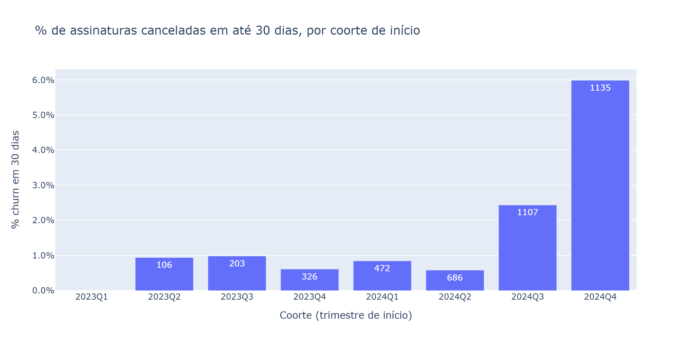
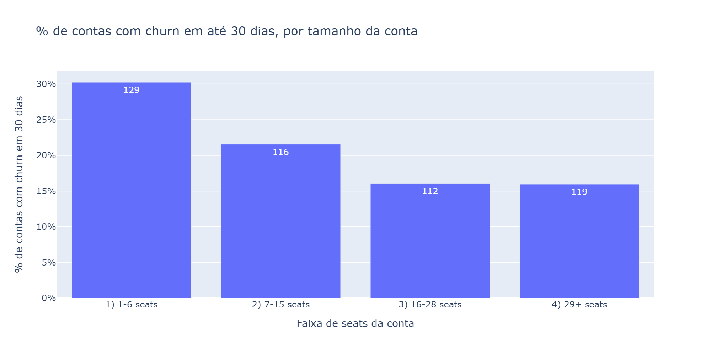

# Submissão — Guilherme Henrique Bilonia — Challenge 001 (Diagnóstico de Churn)

## Sobre mim

- **Nome:** Guilherme Henrique Bilonia
- **LinkedIn:** [Guilherme Bilonia](https://www.linkedin.com/in/guilherme-henrique-bilonia/)
- **Challenge escolhido:** 001 — Diagnóstico de Churn (RavenStack)

---

## Executive Summary

A RavenStack não está perdendo a base antiga, está perdendo **clientes novos logo depois da venda**. **75% da receita perdida no Q4/24 (US$ 652 mil de US$ 872 mil de MRR) veio de assinaturas com menos de 90 dias**, e metade saiu ainda no primeiro mês. A taxa de cancelamento nos primeiros 30 dias passou de ~1% para **6%** exatamente quando o volume de vendas quadruplicou. Nenhuma característica do cliente (plano, indústria, país, canal, uso, suporte) prevê quem vai sair. Três modelos de ML testados não superaram o acaso, o que indica um **problema sistêmico no processo de entrada**, e não um segmento problemático. Os painéis de CS e Produto não enxergam isso porque medem a base inteira, e os instrumentos de medição estão quebrados. **Recomendação principal:** tratar os primeiros 30 dias como a prioridade nº 1 da empresa. Começar esta semana pelas **40 contas que concentram metade da receita em risco**, reestruturar o onboarding para todos os clientes novos e alinhar o ritmo de vendas à capacidade de ativação.

---

## Solução

Toda a análise está em [`index.ipynb`](./index.ipynb): 5 tabelas cruzadas, testes estatísticos, análise de cortes, modelagem e lista de contas em risco. A lista está em `contas_em_risco.csv`.

### Abordagem

1. **Ler o problema como dono, não só como analista.** A pergunta do CEO não é "qual variável correlaciona com churn". É "por que perco clientes se CS e Produto dizem que está tudo bem". Busquei a resposta que reconcilia as três visões, sempre em dinheiro (MRR), não só em contagem de clientes.
2. **Análise bivariada nas 5 tabelas**, com testes adequados a cada tipo de variável (qui-quadrado para categóricas, Mann-Whitney para numéricas, 1 linha por entidade para não inflar a significância) e correção para múltiplos testes.
3. **Análise temporal por coorte, com janela fixa.** Comparar o churn acumulado entre coortes é enganoso, porque coortes antigas tiveram mais tempo para cancelar. Medi todas na mesma régua: "cancelou em até 30, 60 ou 90 dias".
4. **Tabela analítica com 1 linha por assinatura**, com uso e tickets restritos aos primeiros 30 dias, para comparar clientes em igualdade de condições.
5. **Validação de cada achado** (Bonferroni, independência das observações, viés de exposição, dose-resposta) antes de levá-lo ao relatório.
6. **Modelagem preditiva com validação temporal** (treino até 2024Q3, teste em 2024Q4), com métricas adequadas a classes desbalanceadas e intervalos de confiança por bootstrap.

### Resultados / Findings

#### 1. O churn subiu porque clientes novos estão saindo cedo

| Idade da assinatura quando cancelou | MRR perdida no Q4/24 | % do total |
|---|---|---|
| Até 30 dias | US$ 436 mil | **50%** |
| 31 a 90 dias | US$ 216 mil | **25%** |
| 91 a 180 dias | US$ 86 mil | 10% |
| Mais de 180 dias | US$ 134 mil | 15% |
| **Total** | **US$ 872 mil** | 100% |

Comparando coortes na mesma janela de 30 dias:

| Coorte de início | % de assinaturas canceladas em até 30 dias | % da MRR nova perdida em 30 dias |
|---|---|---|
| 2023Q2 a 2024Q2 | 0,6% a 1,0% | 0,1% a 1,6% |
| 2024Q3 | 2,4% | 2,1% |
| **2024Q4** | **6,0%** | **5,7% (US$ 157 mil/mês)** |

A piora coincide com a aceleração das vendas: o número de assinaturas novas por trimestre saltou de 472 (2024Q1) para 2.069 (2024Q4).

#### 2. O perfil do cliente não explica, com uma exceção

Plano, billing, trial, auto-renew, indústria, país e canal de aquisição **não diferem** entre quem sai cedo e quem fica (todos com p > 0,05). Os "achados" populares desse dataset, como DevTools com 31% de churn e Alemanha com 32%, **não são estatisticamente significativos** (p ≈ 0,07 e p ≈ 0,66). A Alemanha tem só 25 contas.

**A exceção é o tamanho da conta.** Contas que perdem assinaturas nos primeiros 30 dias têm mediana de 9 seats, contra 16 das demais (Mann-Whitney p = 0,001, 1 linha por conta, robusto à correção de Bonferroni). Há dose-resposta, e o número de assinaturas por conta é parecido entre as faixas (7,8 a 8,9), o que descarta viés de exposição:

| Faixa de seats da conta | % de contas com churn em 30 dias | % da MRR total | % da MRR perdida em 30 dias |
|---|---|---|---|
| 1–6 | **30%** | 18% | **34%** |
| 7–15 | 22% | 20% | 16% |
| 16–28 | 16% | 23% | 23% |
| 29+ | 16% | 39% | 27% |

**Leitura de dono:** contas pequenas perdem o dobro proporcionalmente, mas **dois terços do dinheiro perdido vêm de contas maiores**. Contas pequenas são parte do problema, não o problema inteiro.

#### 3. Os clientes que saem cedo saem calados

- **~80% das assinaturas canceladas em até 30 dias não abriram nenhum ticket** nesse período. A diferença de churn entre quem abriu e quem não abriu ticket não é significativa (p ≈ 0,29).
- **80% das assinaturas não têm nenhum registro de uso** nos primeiros 30 dias. Com os dados atuais, é impossível medir ativação.

Suporte reativo não resolve um problema em que o cliente nunca chega ao suporte.

#### 4. Por que os números "não batiam" para o CEO

| Quem diz | O que diz | Por que não enxerga o problema |
|---|---|---|
| CS | "A satisfação está ok" | A nota tem 41% de respostas vazias e só existe para quem abre ticket. Quem sai cedo não abre. |
| Produto | "O uso cresceu" | O uso agregado dilui a coorte nova. A telemetria não registra a maior parte dos primeiros 30 dias (78% dos eventos de uso caem fora da vigência da assinatura). |
| Dados de churn | — | Três definições que não batem entre si: a flag da conta marca 22% das contas, os eventos de churn atingem 70%, as assinaturas mostram 9,7%. Todas as 500 contas ainda têm assinaturas ativas: a empresa perde receita dentro de contas vivas, não clientes inteiros. O `reason_code` não bate com o `feedback_text`. |

Os três painéis olham médias da base inteira. O problema está concentrado num recorte que nenhum deles faz: **os clientes recém-chegados**.

#### 5. Modelo preditivo: os dados não sustentam previsão individual

Três abordagens treinadas só com informação disponível no dia da assinatura, com validação temporal:

| Modelo | ROC-AUC | Average Precision (IC 95% bootstrap) | Lift top 10% |
|---|---|---|---|
| XGBoost | 0,48 | 0,064 (0,044–0,096) | 0,89x |
| Regressão logística | 0,50 | 0,075 (0,050–0,115) | 1,33x* |
| Regra (faixa de seats) | 0,51 | 0,064 (0,046–0,084) | 1,03x |
| *Acaso* | *0,50* | *0,060* | *1,00x* |

\*Cerca de 3 casos acima do esperado, dentro do ruído.

Os intervalos se sobrepõem e incluem a linha de base: **nenhum modelo é distinguível do acaso**. O efeito do tamanho da conta é real no agregado, mas pequeno demais para separar um cliente do outro. **Conclusão estratégica:** se não dá para prever *quem* sai, não adianta caçar clientes específicos. É preciso consertar o processo de entrada **para todos**.

#### 6. Contas em risco agora (lista acionável)

Base: assinaturas ativas iniciadas nos últimos 30 dias do dataset (dezembro/2024). A perda esperada é a probabilidade de churn em 30 dias da faixa de seats (calibrada nas coortes de 2024H2) multiplicada pela MRR.

- **850 assinaturas em 319 contas**, com US$ 1,98 milhão de MRR em jogo e **perda esperada de US$ 81 mil/mês** (~US$ 970 mil/ano).
- **40 contas concentram 50% da perda esperada** (US$ 982 mil de MRR em jogo). Outras 68 completam 80%.
- A lista completa, ordenada, está em `contas_em_risco.csv`.

Na prática, a lista prioriza por **dinheiro em jogo**, não por risco individual (que o modelo mostrou não ser previsível). É exatamente o critério certo para decidir onde colocar contato humano.

### Recomendações

Priorizadas por impacto e velocidade. Os impactos são estimativas de ordem de grandeza, a validar com teste controlado.

| # | Ação | Prazo | Impacto estimado |
|---|---|---|---|
| 1 | **Força-tarefa nas 40 contas prioritárias.** O CS liga esta semana para as contas que concentram 50% da perda esperada, sem esperar ticket: kickoff, checklist de ativação e dono nomeado de cada lado. | Esta semana | US$ 40 mil de MRR/mês em risco. Cortar essa perda pela metade preserva ~US$ 20 mil/mês (~US$ 240 mil/ano). |
| 2 | **Onboarding estruturado dos primeiros 30 dias para todo cliente novo.** Toque humano para contas acima de um corte de MRR; trilha automatizada (e-mails, tutoriais in-app, checklist) para contas de até ~15 seats, que perdem o dobro e não comportam um CSM. | 30 dias | Voltar o churn de 30 dias da MRR nova de 5,7% para o patamar de 2024Q3 (~2%) preserva ~US$ 100 mil de MRR por coorte trimestral (~US$ 1,2 milhão de ARR/ano). |
| 3 | **Alinhar o ritmo de vendas à capacidade de ativação.** O volume de entrada quadruplicou em 2024 e o churn precoce subiu junto. Revisar a capacidade de onboarding/CS por cliente novo e amarrar parte da comissão de vendas à retenção em 90 dias. | 60 dias | Ataca a causa provável: crescimento sem estrutura de entrada. Validar a hipótese antes de mudar o comp plan. |
| 4 | **Consertar os instrumentos.** (a) Uma única definição de churn baseada em MRR (NRR e churn bruto de receita); (b) telemetria de uso amarrada à assinatura; (c) pesquisa ativa com cliente novo aos 15 e 30 dias, no lugar do CSAT opcional; (d) entrevista de saída no lugar do formulário. | 60 a 90 dias | Custo baixo. Sem isso a empresa segue sem enxergar o problema, e nenhum modelo preditivo será viável. |

**O que NÃO fazer**, com base nos dados:

- **Não investir em velocidade de suporte para reduzir churn.** Tempo de resposta e resolução não diferem entre quem sai e quem fica, e quem sai cedo nem abre ticket.
- **Não criar programas por indústria ou país** (DevTools, Alemanha). As diferenças não são significativas.
- **Não dar desconto para migrar do mensal para o anual como tática de retenção.** Billing não tem relação com churn. Anual só se justifica pelo caixa.
- **Não investir agora num modelo de ML de churn.** Os dados atuais não têm sinal. Revisitar quando a telemetria de ativação existir.

### Limitações

- **O dataset é sintético.** Várias variáveis se comportam como ruído aleatório, há contas com 10 a 14 assinaturas novas em 30 dias e 78% dos registros de uso caem fora da vigência da assinatura.
- **Amostra pequena para cortes finos:** 108 assinaturas (101 contas) com churn em 30 dias.
- **Associação não é causa.** A ligação entre a aceleração das vendas e o churn precoce é temporal, não demonstrada. O efeito do tamanho da conta pode ter **causalidade reversa**, porque `seats` da conta é um retrato sem data: pode ter sido registrado depois de a conta perder assinaturas. Validar com o histórico de seats antes de agir.
- A coorte 2024Q4 inclui só assinaturas iniciadas até 01/12/2024 (filtro de elegibilidade da janela de 30 dias).
- Sem dados de CAC e de custo de servir, não foi possível calcular o retorno de cada ação. Os impactos acima são ordens de grandeza.

---

## Process Log — Como usei IA

### Ferramentas usadas

| Ferramenta | Para que usou |
|---|---|
| Claude (Cowork) | Leitura do desafio e das soluções públicas do dataset, revisão crítica do notebook a cada iteração, sugestão de testes estatísticos e trechos de código, rascunho dos textos |
| VS Code + Jupyter | Toda a análise, executada e validada por mim |
| pandas, scipy, plotly, scikit-learn, xgboost | EDA, testes de hipótese, coortes, modelagem e bootstrap |

### Workflow

1. **Contexto antes de código.** Pedi ao Claude para ler o desafio e as soluções públicas desse dataset e para se colocar no lugar do CEO, **sem escrever código**. Isso definiu a referência a superar: as soluções públicas param em "DevTools churna mais".
2. **EDA bivariada nas 5 tabelas**, feita por mim, com o Claude revisando o notebook inteiro a cada rodada.
3. **Mudança de modo:** pedi explicitamente que o Claude atuasse como **conselheiro**, fazendo perguntas em vez de entregar respostas prontas. A partir daí, cada achado foi descoberto e escrito por mim.
4. **Análise por coorte com janela fixa**, validação estatística do achado de seats, tabela analítica por assinatura, MRR e tickets.
5. **Lista de contas em risco (regra) → modelos → comparação justa → bootstrap.**
6. **Relatório**, com rascunho gerado pelo Claude a partir dos meus números e revisado por mim.

### Onde a IA (e eu) errou e como corrigi

- **Merge de tickets com assinaturas:** multiplicou os 2.000 tickets para ~20 mil linhas, com 63% dos tickets nos dois grupos. As distribuições ficaram idênticas por construção. Corrigido com merge 1:1 por conta e, depois, com agregação por assinatura.
- **Boxplots sobre colunas de texto:** um `select_dtypes('str')` no lugar de `'number'` fez a conclusão "medianas pareadas" não ter base no código.
- **Qui-quadrado mentiroso:** rodado sobre linhas duplicadas pelo merge (748 em vez de 500), transformou p = 0,07 em p = 0,0002 para indústria e deu `account_name` como "significativo". Também foi aplicado a variáveis contínuas e datas. Corrigido com 1 linha por entidade e Mann-Whitney para numéricas. Um bug (falta de `continue`) fez o qui-quadrado rodar sobre numéricas mesmo depois disso, e o falso positivo de `first_response_time` só desapareceu quando percebi.
- **Viés de exposição nas coortes:** o primeiro gráfico de churn por coorte sugeria que 2023 era pior. Era só tempo de exposição. Resolvido com janela fixa.
- **Leitura errada do `size`:** interpretei o tamanho da coorte como número de churns. Corrigido na revisão.
- **Código do Claude com bugs:** o `.astype(str)` num `qcut` ordenou as faixas alfabeticamente e escondeu a dose-resposta. A primeira probabilidade da regra usava o histórico inteiro e subestimava a perda esperada em ~60%. Recalibrei com as coortes de 2024H2.
- **Vazamento de alvo:** `churn_flag` apareceu como preditor de `churn_30d`, e flags de conta sem data (`plan_tier_acct`, `churn_flag_acct`) poderiam carregar o futuro. Removidos.
- **Métricas:** a matriz de confusão com corte de 0,5 e a acurácia de 93% escondiam um modelo sem sinal. Troquei por ROC-AUC, Average Precision contra a linha de base, lift e IC por bootstrap.

### O que eu adicionei que a IA sozinha não faria

- **A decisão de trabalhar em modo conselheiro**, forçando cada achado a passar pelo meu raciocínio em vez de copiar a resposta da IA.
- **O enquadramento de dono:** tudo traduzido em MRR, a pergunta "os 75% da perda vêm de onde?" e a leitura de que contas pequenas são um terço da perda, e não o problema inteiro. Isso mudou a recomendação de "CSM para contas pequenas" para "onboarding automatizado para pequenas, contato humano por MRR".
- **O julgamento de parar no ML:** aceitar que nenhum modelo funciona, demonstrar isso com bootstrap e transformar o resultado num argumento estratégico ("o problema é sistêmico"), em vez de forçar um modelo para ter um diferencial.
- **As ressalvas de causalidade**, como a causalidade reversa no tamanho da conta e a ligação apenas temporal com o volume de vendas.

---

## Evidências

- [x] Notebook comentado com toda a análise: [`index.ipynb`](./index.ipynb)
- [x] Chat export da sessão com o Claude: [PREENCHER link ou arquivo]
- [x] Lista acionável para CS: `contas_em_risco.csv`
- [x] Git history

---

